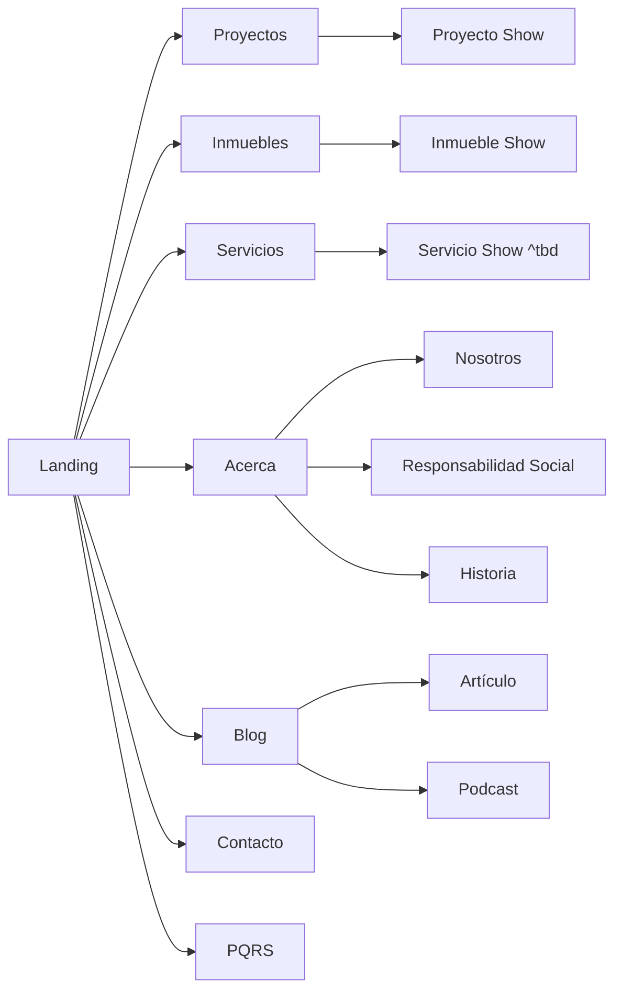

# Brief de Arquitectura: Portal Inmobiliario

## Resumen Ejecutivo

Portal web inmobiliario enfocado en propiedades premium y proyectos de construcción en Colombia, con énfasis en experiencia de usuario y conversión de leads.

## Objetivos Principales

- Maximizar conversión de leads
- Destacar proyectos nuevos
- Facilitar búsqueda de propiedades
- Posicionar servicios inmobiliarios

## Arquitectura Técnica

- Frontend: React.js
- Backend: Node.js/Express
- Base de datos: PostgreSQL
- CMS: Strapi
- CDN: Cloudflare

## Diagrama de Sitio

## Componentes Principales

### Landing

- Hero slider con proyectos destacados
- Buscador avanzado de propiedades
- Sección de proyectos nuevos
- Testimonios
- Calculadora hipotecaria

### Proyectos

- Filtros por ubicación/precio/etapa
- Galería de imágenes 360°
- Planos interactivos
- Formulario de contacto integrado

### Inmuebles

- Búsqueda por mapa
- Filtros avanzados
- Comparador de propiedades
- Tours virtuales

### Servicios

- Servicios de valoración
- Asesoría legal
- Gestión de arrendamientos
- Inversión inmobiliaria

## Aspectos Técnicos

### SEO

- URLs amigables
- Meta tags dinámicos
- Sitemap XML
- Schema.org markup

### Seguridad

- SSL/TLS
- Autenticación JWT
- Rate limiting
- Validación de formularios

### Rendimiento

- Lazy loading
- Optimización de imágenes
- Caché de servidor
- Minificación de assets

## Integraciones

- CRM inmobiliario
- Pasarela de pagos
- Google Maps
- WhatsApp Business API
- Google Analytics 4

## KPIs

- Tasa de conversión por tipo de propiedad
- Tiempo promedio en página
- Leads generados por fuente
- NPS de usuarios
